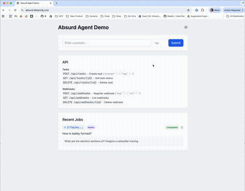

Title: Trying out the Absurd queue for AI Workloads
Date: 2025-12-03
Category: python
Tags: python, postgreSQL, durable-execution, ai
Slug: trying-absurd-postgres-workflows
Authors: François Leblanc
Summary: Testing out Absurd, an experimental durable execution system that uses only Postgres, for AI workloads with expensive LLM calls.

I've been experimenting with [Absurd](https://github.com/earendil-works/absurd), an
experimental durable execution system by [Armin Ronacher](https://lucumr.pocoo.org/) (the
creator of [Flask](https://flask.palletsprojects.com/),
[Jinja](https://jinja.palletsprojects.com/), and [Rye](https://rye.astral.sh/)). It's
explicitly not production-ready, but I wanted to see what kind of niche it might fill.
My test case: AI workloads with expensive LLM API calls.



→ **Jump into the demo app**: [absurd.leblancfg.com](https://absurd.leblancfg.com)

→ **Source code for the demo app**: <code>[leblancfg/absurd-test](https://github.com/leblancfg/absurd-test)</code>

## The Problem with AI Workloads
If you're building anything that makes LLM API calls, you know the pain: requests can take
anywhere from 2 to 60+ seconds, they occasionally fail, and rate limits are sometimes
unpredictable. Traditional task queues like [Celery](https://docs.celeryq.dev/) or
[RQ](https://python-rq.org/) weren't designed for this. They'll restart your failed task
from scratch, re-running all those expensive API calls you already paid for.

Durable execution systems like [Temporal](https://temporal.io/) solve this by checkpointing
your work as it progresses. If a worker dies, the next one picks up exactly where you left
off. Self-hosting Temporal means running a multi-service cluster with its own database.
There are managed options (Temporal Cloud, [Inngest](https://www.inngest.com/)), but if you
want something you can easily self-host alongside existing Postgres infrastructure, the
options thin out.

## Enter Absurd
Armin's [blog post introducing Absurd](https://lucumr.pocoo.org/2025/11/3/absurd-workflows/)
explains his motivation: "durable workflows are absurdly simple, but have been
overcomplicated in recent years." His approach is to put the queue logic entirely in a
single SQL file that turns any PostgreSQL database into a durable task queue with automatic
checkpointing.

I'm generally wary of shoving business logic into databases, but this isn't that. There's
no business logic here &mdash; just using Postgres as a queue via [`SELECT ... FOR UPDATE SKIP
LOCKED`](https://www.postgresql.org/docs/current/sql-select.html#SQL-FOR-UPDATE-SHARE) and
storing checkpoint state in the same transaction. The queue mechanics live in SQL; your
actual work stays in Python (or TypeScript).

If this sounds like [Solid Queue](https://github.com/rails/solid_queue) from Rails 8, you're
not far off &mdash; both use `FOR UPDATE SKIP LOCKED` to turn your database into a job queue.
The difference is what happens when things fail. Solid Queue is a job queue: if a job crashes,
it gets retried from the beginning. Absurd is a durable execution system: it saves checkpoints
as your task progresses, so a crashed task resumes from the last checkpoint, not from scratch.
For quick jobs, this distinction doesn't matter much. For multi-step workflows with expensive
API calls, it's the whole point.

A few things that stood out to me:

**Checkpoints**: When your agent makes three API calls and crashes on the fourth, Absurd resumes
from checkpoint three. You don't re-run (and re-pay for) work you've already done.

**Self-hostable**: If you're building something others might deploy themselves, asking them to also
run Temporal is a big ask. Asking them to have Postgres? They probably already do.

**Works with what's already there** Your existing database does double duty &mdash; no new services
to run.

## A Practical Test
I wrote a [little web app](https://absurd.leblancfg.com)
([source](https://github.com/leblancfg/absurd-test)) combining Absurd with
[FastAPI](https://fastapi.tiangolo.com/), [HTMX](https://htmx.org/), and
[Pydantic AI](https://ai.pydantic.dev/). The setup:

- A web app that accepts prompts via API or simple UI
- Tasks queued durably in PostgreSQL via Absurd
- Workers that process tasks with automatic checkpointing
- Real-time status updates via SSE, wired up through HTMX
- Webhook callbacks when tasks complete

The worker code looks something like this:

```python
@app.register_task(name="run-agent")
def handle_agent_task(params: dict, ctx):
    # Each step is checkpointed automatically
    ctx.run_step("mark-running", lambda: mark_task_running(params["task_id"]))

    # If we crash here, we resume from "run-agent", not the beginning
    result = ctx.step("run-agent", lambda: run_agent(params["prompt"]))

    ctx.run_step("save-result", lambda: save_result(params["task_id"], result))
```

If the worker dies between steps, the next worker loads the checkpoints and continues. No duplicate
API calls, no lost work. The HTMX + SSE combination means the UI stays in sync &mdash; when you submit
a task, it appears immediately and its status updates in real time as the worker progresses. I have
a little hosted version running, but to avoid LLM costs, the worker currently just returns canned
responses.


## The Tradeoffs
Absurd isn't trying to replace Temporal for complex orchestration scenarios. It's
intentionally minimal:

- No built-in retries with backoff (you handle that in your step functions, e.g. with the
  [backoff](https://pypi.org/project/backoff/) package)
- No visual workflow designer
- No managed cloud offering
- Experimental software -- the README says so explicitly

The [Absurd repository](https://github.com/earendil-works/absurd) has SDKs for Python and
TypeScript. Armin's [introductory blog post](https://lucumr.pocoo.org/2025/11/3/absurd-workflows/)
is worth reading for the full context. And if you want to see a working example, my [test
repository](https://github.com/leblancfg/absurd-test) shows how to wire it up with FastAPI
and an AI agent framework. The Python SDK isn't published to PyPI yet, so you'll need to
install it from git.

## When to Consider Absurd

Absurd makes sense when:

- You're already using PostgreSQL
- Your tasks involve expensive or slow operations (LLM calls, external APIs)
- You want durability without running additional infrastructure
- You're building something that needs to be self-hostable

It's probably not the right choice if you need complex workflow orchestration, sub-second
latencies, or enterprise support.

## What I'd Like to See

**Observability.** There's no built-in metrics, tracing, or dashboards. For anything
approaching production use, you'd want to know queue depth, task duration distributions,
failure rates. Currently you'd instrument this yourself. There's an
[open issue](https://github.com/earendil-works/absurd/issues/22) tracking this.

**Dead letter handling.** What happens to tasks that permanently fail? Right now it's not
clear how you'd handle poison messages or set up alerts for repeated failures.

## Conclusion

For AI workloads where the main pattern is "call an API, save the result, maybe call
another API," Absurd is worth looking at. It won't replace Temporal for complex
orchestration, but if you're already on Postgres and want checkpointing without new
infrastructure, it's a reasonable option to explore. I'll probably reach for it on my next
side project that fits this pattern.
