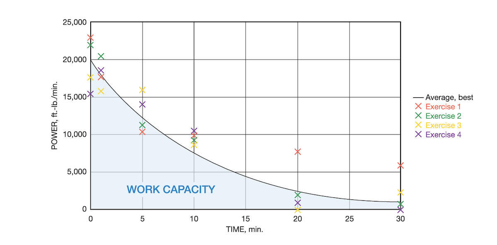

Title: Addicted to My Power Meter
Date: 2025-05-11
Category: Fitness
Tags: cycling, crossfit, power, data, zwift, xert
Slug: addicted-to-my-power-meter
Authors: Francois Leblanc
Summary: What happens when a CrossFit guy gets a smart trainer, discovers power data, and can't stop chasing the numbers.

# Addicted to My Power Meter

This winter I picked up a smart trainer for indoor cycling. I had gotten a slump in motivation from CrossFit, which I'd been doing semi-seriously for about 5 years. I loaded up Zwift, clipped in, and within a week I was hooked. Not on the virtual scenery or the gamification, but on the numbers. Specifically, the power numbers.

I've been doing CrossFit for about five years now, and one of the core ideas in CrossFit is deceptively elegant: the fittest athlete is the one who maximizes the area under their power curve across all types of movement. I know, it's a moutful. But it's literally one of founder Greg Glassman's "definition of fitness".

Sprinting, lifting, gymnastics — it doesn't matter. Fitness, in this framework, is the ability to produce high power output across every time domain and every modality. So when I suddenly had access to a real-time wattage readout on the bike, something clicked. This was a language I already spoke. It's that goddamned power curve, clear as day!

## The jarring return to the road

Then the snow melted.

I went outside for my first ride of the spring and it was genuinely jarring. Not the wind or the traffic — the absence of data. I finished the ride, pulled up my stats, and there was just... nothing. No power curve, no average watts, no peak efforts. Heart rate, sure. GPS, fine. But the thing I actually cared about was gone.

Sure, there's velocity, but that's not a good expression of the work I was doing. In cycling, it's best to [surge when going uphill](surge-cycling-up-a-hill.html), i.e. when you're slowest. A proxy measure maybe, but nothing more!

It bothered me enough that I went out and bought power meter pedals for my road bike. That's when I knew I had a problem, or maybe just an expensive new hobby.

## I've been here before

This isn't my first time getting hooked on a metric. When I got an Apple Watch a few years back, I started wearing it to CrossFit workouts and suddenly had heart rate data to inform my pacing. I'd tell myself things like "don't let your heart rate go above 160 until there's five minutes left." It was a revelation. But I feel like I'd gotten addicted to that too.

Eventually I learned to go by feel. After months of compulsively checking my heart rate, day out, I internalized what different zones actually felt like. I could sense the difference between 140 and 165 without looking at my wrist. The watch became a calibration tool rather than a crutch.

I'm not there yet with power. Right now, I'd have a hard time telling you whether I'm pushing 200 or 240 watts while I'm in the middle of an effort (ed: 9 months later, and I can now!). I know one feels harder than the other, but could I tell you whether I'm above or below threshold? Not yet. And that's what's exciting, I know from experience that the intuition will come. The numbers are just the bridge.

## Two tools that changed how I think about cycling

This whole power obsession has sent me down a rabbit hole of analytics tools, and two in particular have fundamentally changed how I understand cycling performance.

The first is [Xert](https://www.xertonline.com/). I believe the person behind it has a sports physiology PhD, and it shows. Xert builds what they call a "fitness signature" from your ride data — essentially an estimated power curve. But the really clever bit is a metric I haven't seen anywhere else: Maximum Power Available, or MPA.

There's a lot of hand-waving here, but you can think of MPA as your gas tank. Your body has multiple metabolic pathways: ATP, glycogen, lactate, and so on, but you can abstract all of that into a single "battery", or "gas tank". During a ride, you're draining this battery, and your body is replenishing it at some rate. The fitter you are, the bigger the battery and the faster it refills.

Xert overlays this MPA curve on top of your workout data, and it works like an inverted ceiling. When the MPA line drops down and touches your actual power output, that's failure. Your body literally cannot sustain that output anymore. Push 700 watts for 20 seconds, and if that depletes your MPA at that duration, then at the 21st second you have to back off. You won't drop to zero — maybe you can hold 500 watts for a couple more seconds — but you're drawing down a finite reserve.

The second tool is [Best Bike Split](https://www.bestbikesplit.com/). Given a course profile  —  say, up the mountain and back  —  it calculates your optimal power strategy. The insight is that wind resistance scales dramatically with speed, so above about 30 km/h you're mostly fighting the air. The optimal strategy is to save energy on descents, push close to threshold on flats, and spend your reserves on climbs.

Where it gets interesting to me: Best Bike Split uses a fairly simplistic model for pacing your effort. But Xert's MPA model is a much richer representation of how your body actually depletes and recovers energy. If you could overlay Xert's MPA model onto Best Bike Split's course optimization, I think you'd get meaningfully better pacing strategies. That feels like a project worth exploring. Someday.

## The CrossFit connection

And this brings me back to CrossFit, because the same principle applies to every single movement in the gym. A thruster? That's just moving a known weight through a known distance in a known time — you can calculate the wattage directly. Pull-ups, same idea. Even double-unders, which are harder to measure directly, have a fairly fixed cadence that you could estimate power from.

I often thought of "thrusters at 95 lb" and "thrusters at 135 lb" as two different movements (I mean they feel it, that's for sure), but really **they're just the same movement with different loads**. With enough benchmark data, you could draw that selfsame power curve for thrusters, regardless of weight. All loads can be boiled down to power.

Everything is power. Some movements are easier to quantify than others, but the underlying physics doesn't change.

The problem is that in a CrossFit gym, you don't have a power meter. You have a watch with a heart rate sensor, and that's about it. Tools like [Beyond the Whiteboard](https://beyondthewhiteboard.com/) do a great job of tracking workouts and scoring percentiles across movements, but they don't give you the kind of power data that makes cycling analytics so compelling.

## What I want to build next

So here's what I've been thinking about. What if you had a smart segmenter — a tool that could take your heart rate data from a workout, combine it with knowledge of the workout structure, and reconstruct per-movement power estimates?

It would look at your heart rate trace and say: "This block here is when you were doing back squats at the beginning. This section is your Fran. I can guess that you were doing thrusters from minute zero to minute 1:12, then pull-ups, then back to the next round of thrusters." If it knows the movements, the loads, and has your heart rate data, it should be able to back out reasonable power estimates for each segment.

I think I can build this. It's the kind of problem that sits right at the intersection of things I care about: fitness, data, and building tools that scratch my own itch.
