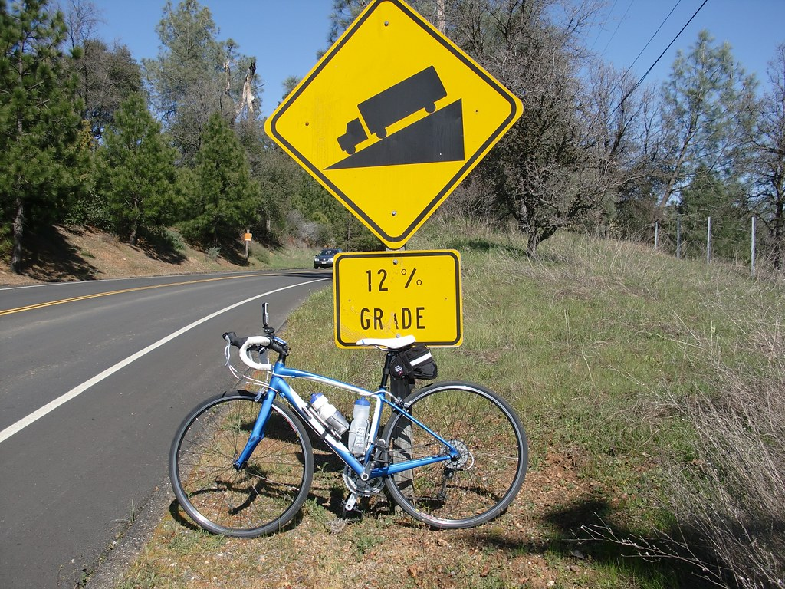

Title: When's the best time to surge when cycling up a hill?
Date: 2025-03-21
Category: Physics
Tags: cycling, physics, simulation, chart.js
Slug: surge-cycling-up-a-hill
Authors: François Leblanc
Summary: A simple cycling simulator that calculates the time it takes to cycle up a hill with a surge of power.

## The Physics of Cycling Uphill
My wife and I recently upgraded from our late 80s steel bikes to more modern ones, and purchased an erg-enabled indoor trainer. I've been spending a surprising number of hours on Zwift, and turns out... it's great fun! I consider myself an all-round athlete, so it was to my great dismay to discover that what I thought was being in OK shape is &mdash; as far as comparison with other indoor cyclists goes &mdash; relatively poor performance! This of course, was very exciting. I love a good training challenge.

I've participated in a few races and noticed many different strategies being used when tackling hills. Having tried various approaches myself, I could definitely feel that some were much better than others. But was that due to luck and good timing on my part, or actually a good strategy? The good news is, cycling is mostly "basic" physics, and we can simulate it!

When cycling, several forces affect your motion:

1. **Propulsive Force**: The power you generate divided by your velocity
2. **Gravity**: Pulls you down, making climbs harder. The heavier you are, the more power you need to climb.
3. **Rolling Resistance**: Friction between tires and road, linear with velocity.
4. **Air Resistance**: Increases with the square of your velocity

The simulation below models a 1,200 m route with a hill in the middle. We're keeping things simple: you can apply a single surge of power, and the simulation calculates the time it takes to cross the finish line for various surge starting points, to see when it's most effective.

## When Should You Surge?

The key question: **When is the optimal time to apply a short power surge to
minimize your total time?**

- On the flat sections?
- At the beginning of the climb?
- In the middle of the climb?
- Near the top of the climb?
- During the descent?

Use the simulator below to find out!

<!-- Input controls with better styling -->

  <h3>Simulation Parameters</h3>
  
  <!-- Primary parameters -->
  

    <h4>Power Settings</h4>
    

      

        <label for="normal_power" style="display: block; margin-bottom: 5px; font-weight: bold;">Normal Power (W):</label>
        <input type="range" id="normal_power_slider" min="100" max="400" value="200" style="width: 100%;">
        <input type="number" id="normal_power" value="200" style="width: 100px;">
      

      

        <label for="surge_power" style="display: block; margin-bottom: 5px; font-weight: bold;">Surge Power (W):</label>
        <input type="range" id="surge_power_slider" min="200" max="800" value="400" style="width: 100%;">
        <input type="number" id="surge_power" value="400" style="width: 100px;">
      

      

        <label for="surge_duration" style="display: block; margin-bottom: 5px; font-weight: bold;">Surge Duration (s):</label>
        <input type="range" id="surge_duration_slider" min="5" max="60" value="20" style="width: 100%;">
        <input type="number" id="surge_duration" value="20" style="width: 100px;">
      

    

  

  
  <!-- Advanced parameters (initially hidden) -->
  

    

      
Advanced Parameters

      

        

          

            <label for="cyclist_mass" style="display: block; margin-bottom: 5px; font-weight: bold;">Cyclist + Bike Mass (kg):</label>
            <input type="range" id="cyclist_mass_slider" min="50" max="100" value="70" style="width: 100%;">
            <input type="number" id="cyclist_mass" value="70" style="width: 100px;">
          

          

            

              <label for="drag_coefficient" style="font-weight: bold; margin-right: 5px;">Drag Coefficient:</label>
              

                i
                

                  The drag coefficient affects air resistance. Lower values mean less drag.
                    
                  <strong>Examples:</strong>
                   • 0.5: Drafting behind another cyclist
                   • 0.9: Racing position on drops
                   • 1.2: Upright position
                

              

            

            <input type="range" id="drag_coefficient_slider" min="0.5" max="1.5" step="0.1" value="0.9" style="width: 100%;">
            <input type="number" id="drag_coefficient" value="0.9" step="0.1" style="width: 100px;">
          

          

            

              <label for="frontal_area" style="font-weight: bold; margin-right: 5px;">Frontal Area (m²):</label>
              

                i
                

                  The frontal area is the cyclist's cross-sectional area facing the wind.
                    
                  <strong>Typical values:</strong>
                   • 0.36 m²: Pro cyclist in aero position
                   • 0.5 m²: Recreational cyclist on hoods
                   • 0.6 m²: Upright position
                

              

            

            <input type="range" id="frontal_area_slider" min="0.3" max="0.7" step="0.01" value="0.42" style="width: 100%;">
            <input type="number" id="frontal_area" value="0.42" step="0.01" style="width: 100px;">
          

        

      

    

  

  
  <button id="plot_button" style="margin-top: 15px; padding: 8px 16px; background: #4CAF50; color: white; border: none; border-radius: 4px; cursor: pointer;">Run Simulation</button>

<!-- Container for the elevation profile -->

  <h3>Elevation Profile</h3>
  

    <canvas id="elevation_chart"></canvas>
  

<!-- Container for the results chart -->

  <h3>Total Time vs. Surge Start Position</h3>
  

    <canvas id="results_chart"></canvas>
  

<!-- Container for optimal result -->

  <h3>Optimal Surge Zone</h3>
  

  
<em>Note: The time curve typically has a "flat spot" where multiple surge points yield similar results. This shows the entire range of surge start times that achieve the fastest overall time (within 0.1 seconds of minimum).</em>

### Understanding the Results
The simulation identifies the zone where your time will be minimized. There might be slight wobbles in some sections: this is just a result of the simulation's granularity. Any spot on the hill between where your "momentum is spent" and before your "surge would be applied downhill" is a good spot to surge.

Let's look at some general conclusions. Of course, this isn't real life! A good cyclist will be able to determine how long and how hard to push for a given hill, in a way that allows them to recover before the next hill or attack.

### Don't surge downhill!
This is the main takeaway from the simulation. Surging downhill is a waste of
energy, as you're already moving quickly and air resistance is high. The best
time to surge is when you're moving slowly, that is, on the uphill section.

I am very guilty of this in real life... and in fact thinking about it is why I
wrote this article in the first place!

### Don't surge before the climb!
I often do this, telling myself I'll "spread the load" a bit before so that the
peak power during the ascent is lower. But in most simulations, you'll find
that the time is dramatically slower if the surge is applied before the climb.
This is because all the extra power is "wasted" by accelerating on flat ground
where air resistance is the dominant force.

### Don't surge before your momentum is spent!
You'll also notice that the first optimal surge point is not exactly as the
start of the climb. This is because the surge is most effective when the rider
is at their slowest speed. And as we're carrying some momentum from the flat
section, the optimal surge point is a bit into the climb. Depending on the
settings, this might be 20-40 meters into the climb.

### Race Dynamics - surge at the bottom, or the crest?
In real racing, optimal surge timing can depend on tactical considerations
beyond pure physics. This simulation doesn't model drafting, but in a race, a
surge would be more effective at dropping riders when drafting is most useful,
i.e. at higher speeds in the downhill section.

This is why you will often see surges applied near the crest of a climb in
professional cycling - it's a strategic move to break away from competitors!
