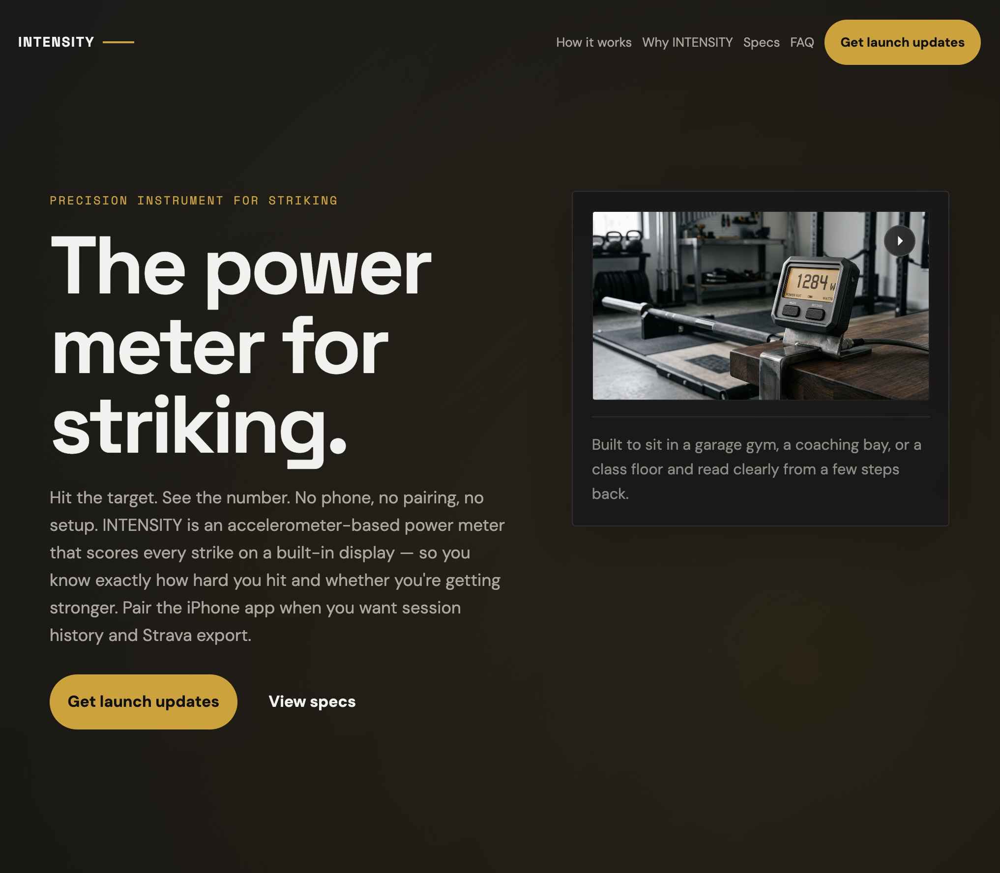

I spent the last month building a power meter for sledgehammer strikes: a pad you hit that tells you how hard you hit it, and whether you can do it again tomorrow.

  

    <iframe
      src="https://www.youtube.com/embed/H8uqRSPA_LM"
      title="Intensity Pad sledgehammer strike demo"
      frameborder="0"
      allow="accelerometer; autoplay; clipboard-write; encrypted-media; gyroscope; picture-in-picture; web-share"
      allowfullscreen
      style="position: absolute; inset: 0; width: 100%; height: 100%;">
    </iframe>
  

This is the founder story: what I built, why I chose it, and what a month of hardware taught me. The engineering writeup will come later, once I've talked to someone who actually understands IP strategy. For now, the public home for the project is <https://intensity.systems/> — sign up there if you want to follow along.

## Why I used my sabbatical on this

After five years at Shopify, employees get [a paid month off](https://www.benefitscanada.com/archives_/benefits-canada-archive/how-shopify-is-supporting-employee-well-being-with-additional-paid-time-off/) to do whatever the hell they want. I took mine in April 2026. Thanks Tobi!

I've been telling myself — and anyone who'd listen — for about six years now that I'd eventually end up doing something entrepreneurial. I've made small runs at independent things before: a band I toured with for two years in my twenties, a few abandoned company ideas, and during the pandemic a small gig selling weightlifting equipment out of my basement. That last one actually worked and taught me more about sourcing, logistics, and customer service than any job has. But I've never taken a dedicated, concentrated swing at an idea on my own time.

So I gave myself a rule: 20 working days, one idea, push on it hard enough to find out if it has legs. I have a folder with a dozen ideas in it, most of them software, many of them some version of "a better mousetrap." I picked this one because it was the one where I'd be forced to learn the most new things: hardware, enclosure design, product marketing, customer development... and because it felt doable in a month. Barely.

## The gap I kept staring at

If you spend enough time around functional fitness, you notice that some modalities are beautifully instrumented and some are basically raw.

Running has pace, splits, heart rate, GPS. Cycling has [power meters](addicted-to-my-power-meter.html) and an entire vocabulary for thinking clearly about effort. Rowing and the ski erg aren't exactly underserved either. Lifting gives you known loads moving through known distances; with a stopwatch and a notebook, you can at least estimate work and power.

Then there's the other category. Loud, messy, explosive, and weirdly hard to measure. Striking with a sledgehammer is the cleanest example, but it's part of a broader movement pattern — core flexion, driving a load downward with your whole body. Chopping wood, driving a stake, even the tiny domestic version of snapping a stubborn ketchup bottle downward. It's a fundamental human movement, yet in modern gyms I think it's criminally under-programmed. Very few people train it seriously. My hypothesis is simple: if a movement isn't measurable, it rarely becomes programmable. I set out to change that.

I am not a sledgehammer specialist. I've probably swung one for a total of three hours in my life. That was part of what made the idea interesting — it wasn't that I'd discovered a massive, mature category desperate for gadgets. It was that there was a fundamental movement here, naturally measurable, physically compelling, and oddly underserved.

## 20 days, one prototype

The first week was reading, sketching, and ordering parts with names I'd never heard of a month earlier. The second week was when hardware started teaching me lessons. A connector I'd picked because it looked robust turned out to fail intermittently under exactly the kind of shock load the pad exists to measure. A sensor mount I was quietly proud of stopped working on the third session. Every few hours, reality would delete part of my mental picture and hand me back a more honest one.

The expensive mistake was a mechanical design choice I committed to on day four and didn't abandon until day twelve. Eight days. I could see the problem by day seven and spent the next five trying to rescue a decision I should've thrown out. No amount of whiteboarding would've surfaced it ahead of time, and no blog post by someone else would've convinced me either. Some lessons you pay for in hours.

  

    <iframe
      src="https://www.youtube.com/embed/bOybwyFbnNQ"
      title="Early control unit walkthrough"
      frameborder="0"
      allow="accelerometer; autoplay; clipboard-write; encrypted-media; gyroscope; picture-in-picture; web-share"
      allowfullscreen
      style="position: absolute; inset: 0; width: 100%; height: 100%;">
    </iframe>
  

By the end of week three I had a pad that could take a real strike, a control unit that survived being dropped, and an iOS app pulling live data off of it. Week four was calibration: swinging a sledgehammer at the pad in my basement, over and over and over, until the numbers coming out the other end started to look like they meant something.

That chart was the moment the project stopped being a thought experiment. I've always liked the humbling quality of building new things — your job is to become less wrong, one concrete mistake at a time — and hardware is less patient about it than software. Software lets you be clever for a long time before reality forces the issue. A sledgehammer does not.

## What I actually believe now

Power data didn't just add numbers to my cycling; it changed the "texture" of the activity. It gave me a better language for pacing, comparison, and curiosity — I wrote about that [here](addicted-to-my-power-meter.html) — and after a few months I could feel 220 watts the same way I used to feel a heart rate of 160. The numbers were a bridge to better intuition.

That's the bar for Intensity Pad. Not "look, I made a gadget" — there are already plenty of gadgets in fitness and most of them don't matter. The thing worth chasing is whether a class of training people already find physically compelling could become more legible, more motivating, and more trainable once the right measurement exists. That's a much higher bar, and it's the only one I care about.

The prototype didn't prove every detail. What it did was change the emotional status of the idea. Before the sabbatical, Intensity Pad was a compelling concept in my head. Now it's a thing with mass — something people can pick up, abuse, argue about, and watch fail in specific rather than hypothetical ways. Specific disappointment is vastly better than vague optimism. Once an idea starts failing concretely, you can work with it.

## Where it goes next

The immediate next step is not a grand launch. It's more reality. More testing, more real use, a tighter form factor, and more time with the simple question underneath all of this: does it get more interesting the more real it gets, or less? Some ideas are compelling from a distance and collapse on contact. Others get sharper, more specific, and more stubborn the closer you get. My hope, obviously, is that this is the second kind.

The public home for the project is **[intensity.systems](https://intensity.systems/)**. If you want to follow along — or if you're the sort of person who likes the intersection of measurement, training, and slightly ridiculous hardware — sign up there.

The month confirmed one thing for me: once you've watched one part of training become legible through good instrumentation, it's very hard not to start looking for the next dark corner.
