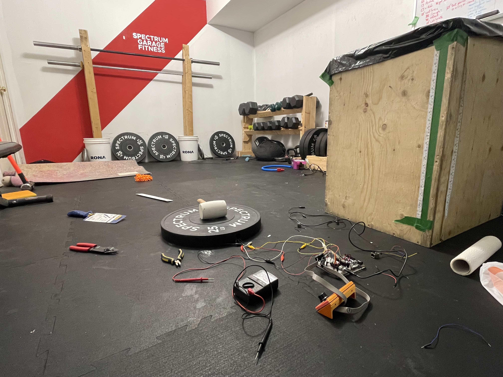
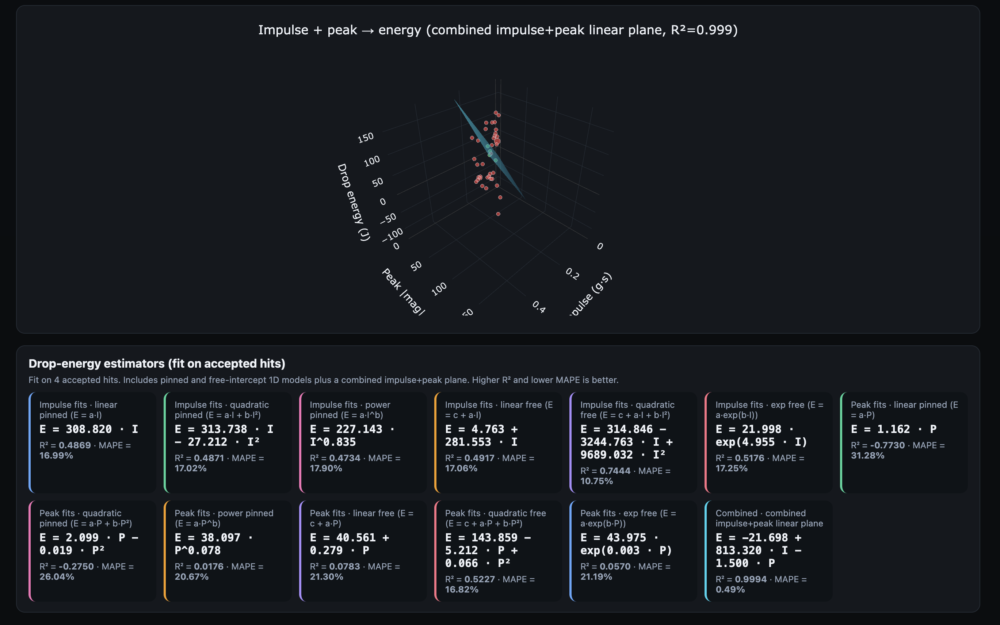

I spent the last month building a power meter for sledgehammer strikes: a pad you hit so you can see
how hard you hit it throughout a workout, and track that over time. I call it the Intensity Pad.

  

    <iframe
      src="https://www.youtube.com/embed/H8uqRSPA_LM"
      title="Intensity Pad sledgehammer strike demo"
      frameborder="0"
      allow="accelerometer; autoplay; clipboard-write; encrypted-media; gyroscope; picture-in-picture; web-share"
      allowfullscreen
      style="position: absolute; inset: 0; width: 100%; height: 100%;">
    </iframe>
  

>**Dear reader**
>
>I'd eventually like to turn this into a product that people can purchase. Because of that, this
>post intentionally focuses on how I got to the final proof-of-concept, and skips the technical
>aspects.
>
>For now, the public home for the project is the very unfinished <https://intensity.systems/>. Sign
>up there to follow along.
>
>If you're interested and a hardware person though, please reach out directly!

## Why I used my sabbatical on this

After five years at Shopify, employees get [a paid month
off](https://www.benefitscanada.com/archives_/benefits-canada-archive/how-shopify-is-supporting-employee-well-being-with-additional-paid-time-off/)
to do whatever the hell they want. I took mine in April 2026. Thanks Tobi!

I've been telling myself, and anyone who'd listen, for about six years that I'd eventually do
something entrepreneurial. I've made small runs at independent things before: I co-founded and
toured with a band for a couple years in my twenties, a few abandoned company ideas, and during the
pandemic a small gig selling weightlifting equipment out of my basement. That last one worked, and I
got to learn about sourcing, logistics, and customer service. But I'd never taken a dedicated,
concentrated swing at an idea on my own time.

So my goal was: 20 working days, one idea, and push on it enough to see if it has legs. Of all the
ideas I had, I picked that sledgehammer pad because it seemed to force me to learn the most things I
didn't already know: hardware, CAD/physical design, product marketing, market research, etc. Also
because it felt doable in a month... barely.

## The gap I kept staring at

After spending enough time around functional fitness, you end up noticing how some modalities are
beautifully instrumented, and some are basically raw. It really depends on the movement and the
implement.

Running has pace, splits, heart rate, GPS. Cycling has [power
meters](addicted-to-my-power-meter.html) and an entire vocabulary for thinking clearly about effort.
Rowing and the ski erg aren't exactly underserved either. Lifting weights gives you known loads moving
through known distances; so "15 barbell cleans for time at 100 lb", not only is that a comparable
effort when you do it again next month, but also if your friend does it.

Then there are impact movements: mace, sledgehammer, slam balls. Really fun workouts, but basically
impossible to measure or benchmark. There's a broad category of training that I call "impact
training" that includes those movements, categorized by: core flexion, a load driven downward, with
legs and trunk contributing instead of just arms. And &mdash; ok forgive me I'll get on a soapbox
now &mdash; it's a fundamental human movement! Chopping wood. Driving a stake. 8 year old me smashing
down rocks to see if they had gold inside (they never did). It should be on the same rung as
squatting and snatching in the pyramid of training movements!

But because they're a crap shoot, "modern" training barely programs the movement. My hypothesis is
simple: if impact training was measurable, it would have its place along the rower, bike and barbell
in the gym. And if I trust my napkin math, it can probably be sold at a fraction of that rower or
ski-erg price point.

That said, I'm not a sledgehammer specialist. Honestly before this I've probably only spent a grand
total of three hours doing it. That was part of the appeal too, as I was staring at a mismatch: a
physical, satisfying movement with a clean signal "hiding" inside it.

## 20 days, one prototype

For the preceding 4 months I'd already been preparing and researching that project: physics models
in Python, playing with toy sensors and an Arduino, purchasing parts and a shortlist of sensors I
wanted to test out, and overall planning for the month. Also: sourcing parts is a bitch.

Week one was just getting something working end-to-end. Barely any calibration or attention to
detail. But that way, you're forced to rub your nose in what the actual bugs and rough edges are,
and can plan accordingly after. What I learned then: most sensors saturate (not exactly a surprise,
but SHIT), and sending I2C data down a relative long wire can cause issues. I knew both were
potential issues, but, well, now I knew what I'd focus on after.

By week two, I had a fully working proof of concept, tiny LCD display, and a buggy iOS app that
showed live data. I then set out on building prototype pad #2 with the sensor I'd picked.

I started week three testing out that new pad, with days of noisy calibration I couldn't make heads
or tails of. The sensor I picked from the initial shortlist failed intermittently... probably
because I hadn't soldered it properly. But by then, it was potted in epoxy! No soup for you.

That third week was basically a write-off. Every few hours, reality deleted part of my mental model
and handed me back a worse-looking, more accurate one.

  

    <iframe
      src="https://www.youtube.com/embed/bOybwyFbnNQ"
      title="Early control unit walkthrough"
      frameborder="0"
      allow="accelerometer; autoplay; clipboard-write; encrypted-media; gyroscope; picture-in-picture; web-share"
      allowfullscreen
      style="position: absolute; inset: 0; width: 100%; height: 100%;">
    </iframe>
  

By the end of week four though, freshly back from the drawing board, I had a pad that could take a
real strike, a control unit with good enough UX, and an iOS app pulling live data off of it.

That last week's focus was a second stage of calibration. I ended up collecting over 100
calibration drops with known weights and heights, and was able to fit a model with a decent fit,
even if I say so myself.

The main challenge with calibration is that "distance from sensor" is the main source of noise in that
dataset. I started off thinking I'd need a secondary hit detector system and add that signal to the
model. But after a couple days, I reversed course: it's perfectly acceptable that athletes get lower
numbers if they don't hit the sweet spot. In fact, that might even be a good thing: it encourages
better technique and accuracy.

From there, I was able to share with friends and reached out to a couple athletes, who hopefully
become my first batch of beta testers.

## What I actually believe now

Power data for cycling completely changed how I approach that activity, and made me rethink much of
the other training I do in other sports. I wrote about that [here](addicted-to-my-power-meter.html).
After a few months, I could feel 220 watts the same way I used to feel a heart rate of 160. The
numbers became a bridge to better intuition.

So, that's the bar for Intensity Pad. Plenty of fitness gadgets already exist, and most of them
don't matter. The thing worth chasing is whether a class of training (which I'm calling 'impact
training' here) that people already find physically compelling gets more repeatable, legible, and motivating
once the right measurement exists. That bar is higher, and it's the only one I care about.

I'm proud of that work as well. As someone used to working with electrons, there's something really
compelling about working with atoms. And now that idea is made concrete: people can pick it up,
abuse it, argue about it, and watch it fail in specific rather than hypothetical ways. Specific
disappointment beats vague optimism.

## Next steps

The next steps are about ansewring two questions: what will my handful of beta users think about it,
and how can it be manufactured cheaply. Both unfortunately come with potential deal-breakers, but so
far I have a good feeling on both counts.

You can find the public home for the project at **[intensity.systems](https://intensity.systems/)**.
If you want to follow along, or if you're the sort of person who likes the intersection of
training, measurement, and slightly ridiculous hardware, sign up there.

And if there's one thing for me: once you've watched one part of training become legible through
good instrumentation, it's very hard not to start looking under all the other rugs in your house,
and see what else can be done. I realize I'll sound like hyperbole, but I really feel like there's a
holy grail of training insights out there, and we're just scratching the surface. Ultimately, my
hope is to get there.
