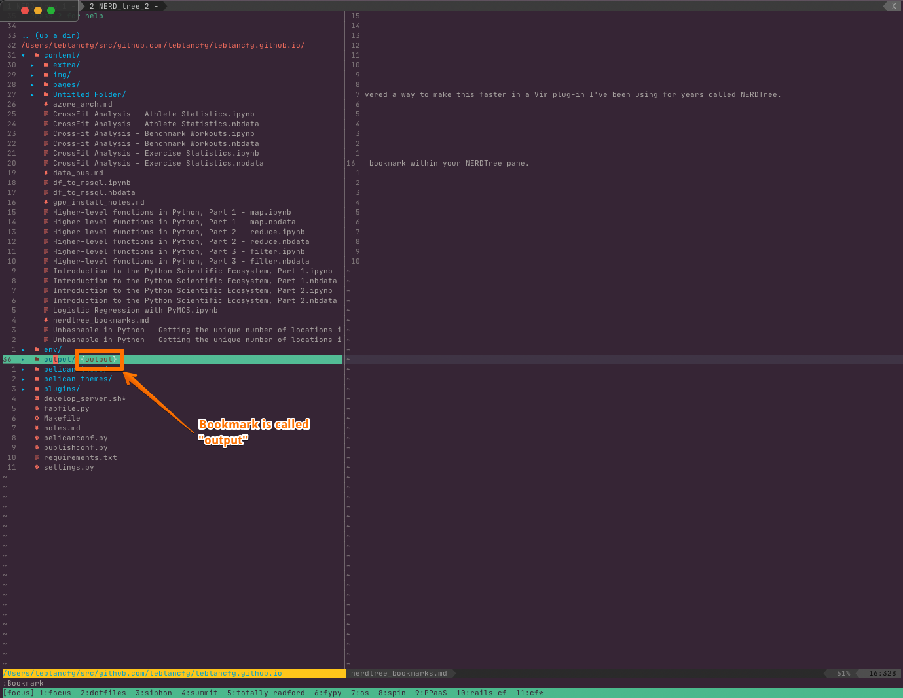

Title: TIL: NERDTree Bookmarks
Date: 2023-03-22
Category: Vim
Tags: vim, nerdtree, bookmarks
Slug: til-nerdtree-bookmarks
Authors: François Leblanc
Summary: NERDTree Bookmarks is a plugin that allows you to bookmark files and directories in NERDTree.

As a developer, you probably spend a lot of time navigating through the directories of your project. Whether you're looking for a specific file, checking your tests, or exploring a new feature, it can be time-consuming to constantly type in the same directory paths. Fortunately, I just discovered a way to make this faster in a Vim plug-in I've been using for years called NERDTree.

Bookmarks allow you to save your most frequently used directories and easily navigate to them with just a few keystrokes. Unlike regular bookmarks in your web browser, NERDTree bookmarks are saved to a file on your computer, so they work across multiple sessions and computer restarts.

So instead of repetitively opening and closing the same directories when moving around, you can just bookmark them and quickly jump to them whenever you need to.

# Creating a New Bookmark
The following commands are only accessible when your cursor is in a NERDTree pane. If you're not seeing the command show up, this might be why.

To create a new bookmark, simply navigate to the directory you want to save in NERDTree, and press `:Bookmark` to assign a shortcut to that bookmark. For example, to save a bookmark in the `tests/` folder, place your cursor on top, press `:Bookmark`, and you will then be able to see this new bookmark within your NERDTree pane.

By default there is no shortcut assigned to the bookmark, but a simple `:Bo<Tab>` should suffice.

# Jumping to an Existing Bookmark

To jump to an existing bookmark, you'll need to use the `:OpenBookmark <BOOKMARK>` command. Again, using tab completion typing e.g. `:OpenBookmark output` ends up being a quick `:Op<Tab> o<Tab>`. Try it for yourself!

# Listing and Editing Bookmarks

You can list and edit all your existing bookmarks by typing `:EditBookmarks` in NERDTree. This will display a list of all your bookmarks and their corresponding shortcuts, which can be edited, deleted, etc.

In conclusion, NERDTree bookmarks are a powerful feature that can save you a lot of time and make your development workflow more efficient. By creating and managing your bookmarks, you can quickly navigate through your project and focus on what really matters - writing great code!
