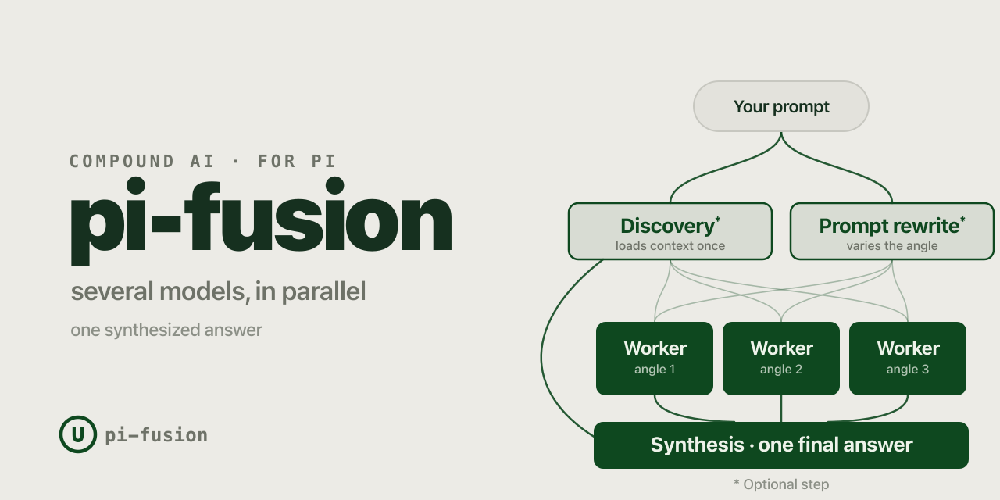

Title: pi-fusion: Local inference-time scaling for coding agents
Date: 2026-06-14
Category: cli, ai
Tags: cli, ai, llms, terminal, pi, agents, test-time-compute, engineering
Slug: pi-fusion-local-inference-time-scaling-for-coding-agents
Authors: François Leblanc
Summary: Why I built a local pi extension for OpenRouter Fusion-style planning panels, with the parts exposed.

OpenRouter's Fusion feature got my attention because it matched results from Binks, an internal
code-review project I've been working on. In those evals, panels of model calls kept doing better
than I expected.

The first surprise was that a handful of fast, "dumber" models could match or beat parts of our
benchmark. The second surprise was that a panel of frontier models could beat any single model in
the panel. The mix mattered: cheap planners plus a strong synthesizer behaved differently from a
frontier-only panel, and both were useful in different places.

I wanted that shape in my daily `pi` loop, but I didn't want every fused turn to go through
OpenRouter. I wanted to swap models, change worker count, restrict tools, cap output, and inspect
exactly what got handed to the main agent.

So I built [an extension for `pi-coding-agent` called
`pi-fusion`](https://github.com/leblancfg/pi-fusion) that recreates it, plus a few more bells and
whistles.



It runs a local planning panel before the normal actor turn. It can load shared context, split your
prompt into a few angles, run independent worker agents in parallel, and write their notes into the
actor's first turn.

One design rule for production workloads matters more than the rest: every bit of output that can
influence the actor goes through the normal `pi` session file. I don't want hidden extension state
changing what the agent does. If the actor sees it, it's in the session. That makes turns resumable
and keeps audit logs in one place.

## Why panels are useful

The tradeoff is where the extra calls go and what the synthesizer can do with them.

For cheaper runs, I like using fast models as planners and the current session model as the
synthesizer. The workers aren't expected to produce the final answer. They inspect the problem, find
likely paths, and disagree in useful ways. Wall-clock time stays reasonable because the workers run
in parallel.

For expensive runs, you can put frontier models in the panel and let another strong model
synthesize. That costs more and takes longer. It can also catch mistakes that any one model missed.
I don't use that for every task, but it's the mode I want available when the work has hidden
coupling or a high cost of being wrong.

This fits the research thread around inference-time scaling. Snell et al.'s
["Scaling LLM Test-Time Compute Optimally"](https://arxiv.org/abs/2408.03314) treats test-time
compute as another scaling axis. Brown et al.'s
["Large Language Monkeys"](https://arxiv.org/abs/2407.21787) shows how repeated sampling can amplify
weaker models. Wang et al.'s ["Mixture-of-Agents"](https://arxiv.org/abs/2406.04692) reports gains
from aggregating multiple LLM agents. BAIR's
["The Shift from Models to Compound AI Systems"](https://bair.berkeley.edu/blog/2024/02/18/compound-ai-systems/)
gives the broader framing: the system around the model matters.

I'm not claiming that `pi-fusion` proves anything new. I built it because the shape kept showing up
in papers, in OpenRouter's product, and in my own code-review evals. The missing piece for me was a
version I could run locally in the terminal and modify when the defaults were wrong.

## What a fused turn does

A fused turn has four steps:

1. Discovery loads shared context from the repository. In read-only mode, it only gets search and
   file-reading tools.
2. Prompt rewrite turns the original request into separate worker angles.
3. Workers run as headless `pi` subprocesses and write short planning notes.
4. Synthesis puts discovery, prompt variations, and worker notes into the main actor turn.

Discovery and rewrite are optional. Worker count is configurable. The synthesis model can be the
same model you're already using in `pi`, or a different one.


A fused turn adds latency. On the setup I use most often, it's roughly eight to ten seconds before
the actor starts. I don't want that for typo fixes. I do want it when I'm asking for a bug hunt, a
refactor plan, or a review of code I don't know well.

When it works, the actor starts with a map: likely files, competing theories, edge cases, and places
where the workers disagreed. That beats watching it confidently edit the wrong file and then dig
itself out.

## Built for real use

I'm aiming this at production use, not a demo that only behaves in a clean repo.

Discovery output, rewritten prompts, worker notes, and the synthesis bundle all get written into the
`pi` turn through `before_agent_start`. There's no private side-channel where hidden extension state
changes what the agent does. The user's original message stays intact, and the fused planning bundle
is per-turn rather than something that piles up across the conversation.

Worker subprocesses run with `--no-extensions`, because recursive fusion is a funny bug report
exactly once.

Tool access is tunable. You can let discovery and workers use the normal tools, or you can force
them into read-only planning:

```text
/fusion tools read-only
```

In read-only mode, planners can inspect the repo with tools like `read`, `grep`, `find`, and `ls`,
but they can't edit files. That's usually how I run it. Let the panel argue. Let the actor write.

As a first smoke test, I ran the Binks PR-review prompt against an intentionally broken local diff
with three read-only fusion workers and a GPT-5.5 synthesis turn. It found the bug and produced JSON
that validated against Binks' review-output models.

Everything is configurable from the TUI, a dotfile, or CLI flags. Global presets live in
`~/.pi/agent/fusion.json`. Project presets live in `.pi/fusion.json`, which makes repo-specific
panels easy to share or commit. You can control worker count, models, reasoning effort, tool access,
output budgets, context budgets, timeouts, and prompt templates.

For repeatable starts, the same controls are available as flags:

```bash
pi --fusion-enabled \
  --fusion-workers 3 \
  --fusion-planner-tools read-only \
  --fusion-worker-model google/gemini-3.5-flash \
  --fusion-worker-thinking medium \
  --fusion-synthesis-model openai/gpt-5.5 \
  --fusion-synthesis-thinking xhigh
```

My bias here is infrastructure: plain controls, visible state, replaceable pieces. The defaults
should be useful, but every important part should be exposed. You should be able to build on it,
too.

## Trying it

Install from npm:

```bash
pi install npm:@leblancfg/pi-fusion
```

Or install straight from GitHub:

```bash
pi install git:github.com/leblancfg/pi-fusion
```

Then open `pi` and arm a fused turn:

```text
/fusion
/fusion on
```

The code and docs are here:
[github.com/leblancfg/pi-fusion](https://github.com/leblancfg/pi-fusion).
